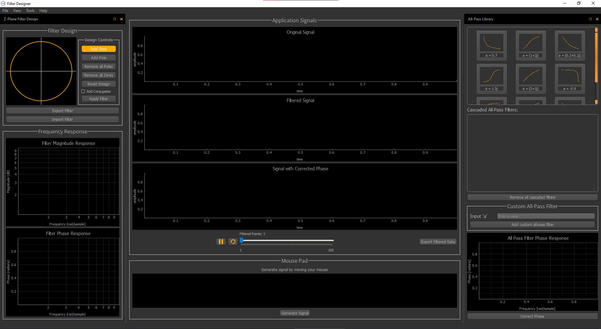

# FilterMaster

FilterMaster makes digital filter design easy and practical, with features like real-time testing and a customizable library of filters. It is a user-friendly desktop app for creating digital filters. It also lets you see the filter's impact on a signal of your choice, along with fixing phase issues in this signal. This can be done by picking a ready-made filter from a library or creating your own.

<div>
  <a href="README_Resources/App_UI.jpg">
    
  </a>
</div>

## Table of Contents:
- [Description](#description)
- [Project Features](#project-features)
- [Quick Preview](#quick-preview)
- [Executing program](#executing-program)
- [Help](#help)
- [Contributors](#contributors)
- [License](#license)

## Description

FilterMaster is a desktop application designed to streamline the creation of digital filters in a user-friendly manner. Users can easily define filter characteristics by specifying the coordinates of zeros and poles. The application provides visualizations of the filter's magnitude and phase response, offering valuable insights into its behavior.

A notable feature is the real-time filtering capability, where users can observe the immediate impact of their filter design on a dynamically generated signal. The application includes an independent mouse area, allowing users to translate their mouse movements into a plotted signal. The real-time filtration process then dynamically applies the designed filter to this mouse-generated signal. Additionally, users have the option to import their own signal data from their computer.

Furthermore, FilterMaster empowers users to address phase distortions in imported signals, providing a straightforward solution for fine-tuning signal phases. Users can seamlessly resolve phase distortion issues by selecting an all-pass filter from a predefined library or customize an all-pass filter within the application. Notably, any custom filters created by users are seamlessly integrated into the library, eliminating the need to re-add them in future sessions.

The application encompasses additional features, which will be further detailed in the features section. FilterMaster is a user-friendly tool that prioritizes simplicity and practicality in digital filter design.

## Project Features
:white_check_mark: **Full-Control on your filter design, You can**
- :heavy_check_mark: add Zeros & Poles to Z-Plane unit circle.
- :heavy_check_mark: remove specific zero or pole
- :heavy_check_mark: delete all zeros or all poles or reset the design in one click.
- :heavy_check_mark: drag the zeros and poles and change their positions
- :heavy_check_mark: add conjugates of the existing zeros & poles
- :heavy_check_mark: visualize the magnitude and phase response of your designed filter
- :heavy_check_mark: check filter examples from the "Tools" menu
- :heavy_check_mark: import a filter through a specifiec button or by dragging and dropping the file on the unit circle
- :heavy_check_mark: export the designed filter as a CSV file

:white_check_mark: **Import and plot a signal data**

:white_check_mark: **Generate a signal data by your mouse movement in a specified area**

:white_check_mark: **Apply the designed filter on your signal**

:white_check_mark: **Control the rate of the filtered points per sec**

:white_check_mark: **Pause/Play/Reset the realtime plotting and filteration of your signal**

:white_check_mark: **Export the filtered data**

:white_check_mark: **Correct the phase distortion using the provided all-pass filters library**

:white_check_mark: **Customize an all-pass filter and integrate it into the library**

:white_check_mark: **Visualize the cascaded all pass filteres phase response and apply it on the signal**

## Quick Preview

#### Filter Design Control: Adding and Removing Zeros & Poles, Adding Conjugates
#### Filter Examples
#### Import & Export Filters
#### Import Signal
#### Signal Generation using Mouse Movement
#### Real-Time Filtration
#### All-Pass Library
#### Phase Correction
#### Customizable Design
#### Handling User Interactions: Popup Errors

## Executing program

To be able to use our app, you can simply follow these steps:
1. Install Python3 on your device. You can download it from <a href="https://www.python.org/downloads/">Here</a>.
2. Clone the repository:
```
git clone https://github.com/Team-19-DSP-Tasks/FilterDesigner.git
```
2. Install the required packages by the following command.
```
cd FilterDesigner
pip install -r requirements.txt
```
3. Run the file with the name "filterDesignUI.py"

## Help

If you encounter any issues or have questions, feel free to reach out.

## Contributors

Gratitude goes out to all team members for their valuable contributions to this project.

<div align="center">

| <a href="https://github.com/cln-Kafka"></a> | <a href="https://github.com/MuhammadSamiAhmad"></a> | <a href="https://github.com/MohamedSayedDiab"></a> |
| :-: | :-: | :-: |
| [Kareem Noureddine](https://github.com/cln-Kafka) | [Mohamed Sami](https://github.com/MuhammadSamiAhmad) | [Mohamed Sayed](https://github.com/MohamedSayedDiab) |

</div>

## License

All rights reserved © 2023 to Team 19 of Digital Signal Processing Course - Systems & Biomedical Engineering, Cairo University (Class 2025)
